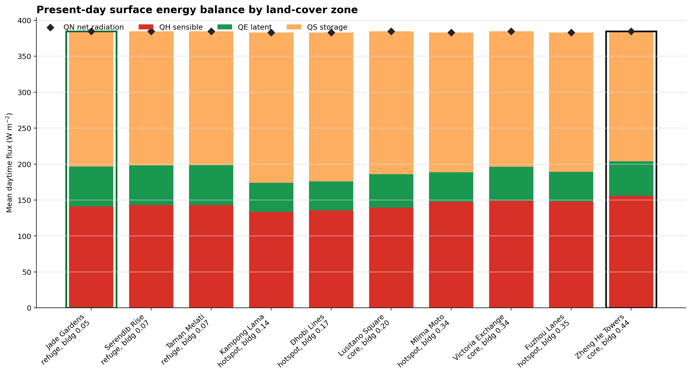
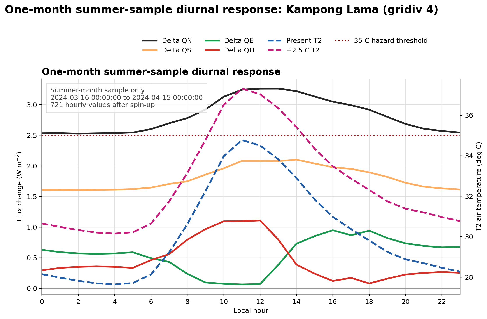
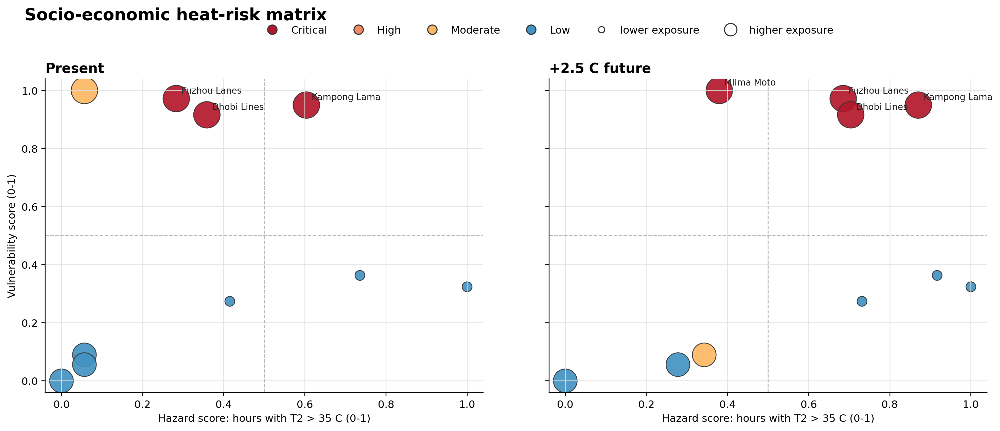

<style>
  body {
    background: #ffffff;
  }

  .container-lg {
    max-width: min(1480px, calc(100vw - 64px)) !important;
    padding-left: 32px !important;
    padding-right: 32px !important;
  }

  .markdown-body {
    font-size: 18px;
    line-height: 1.65;
  }

  .markdown-body h1 {
    font-size: 2.6rem;
    line-height: 1.15;
  }

  .markdown-body h2 {
    margin-top: 2.2rem;
    font-size: 2rem;
  }

  .markdown-body h3 {
    margin-top: 1.8rem;
    font-size: 1.45rem;
  }

  .markdown-body img {
    display: block;
    width: 100%;
    max-width: 1320px;
    height: auto;
    margin: 1.5rem auto;
  }

  .markdown-body table {
    display: table;
    width: 100%;
    font-size: 0.95em;
  }

  .markdown-body th,
  .markdown-body td {
    padding: 0.55rem 0.7rem;
  }

  @media (max-width: 760px) {
    .container-lg {
      max-width: 100vw !important;
      padding-left: 18px !important;
      padding-right: 18px !important;
    }

    .markdown-body {
      font-size: 16px;
    }

    .markdown-body h1 {
      font-size: 2rem;
    }

    .markdown-body h2 {
      font-size: 1.55rem;
    }

    .markdown-body table {
      display: block;
      overflow-x: auto;
      white-space: nowrap;
    }
  }
</style>

# UDA-city Heat Hazard and Socio-Economic Risk Report

This report summarises a SUEWS/SuPy analysis for **UDA-city**, a synthetic,
lower-income, hot-humid, Colombo-like city with 10 neighbourhoods. The aim is to
separate the physical heat hazard from the socio-economic risk bridge: SUEWS
estimates the environmental heat signal, while the risk indicator adds exposure
and vulnerability.

The analysis compares the provided **present hot-humid forcing** with a
humidity-preserving **+2.5 C future pseudo-warming**. Anthropogenic heat (`QF`)
is off in this challenge setup, so population affects exposure and vulnerability
only; it does not add heat to the SUEWS energy balance.

## 1. Executive Summary

- **Highest socio-economic risk:** Kampong Lama (`gridiv 4`) is the highest-risk
  district in both present and future scenarios because it combines substantial
  dangerous-heat hours with maximum daytime exposure and very high vulnerability.
- **Critical present-day risk:** Kampong Lama, Dhobi Lines, and Fuzhou Lanes are
  already critical-risk hotspot districts under the reference bridge.
- **Critical future risk:** Under +2.5 C pseudo-warming, Mlima Moto also becomes
  critical risk, giving four critical hotspot districts.
- **Hottest does not mean highest risk:** Jade Gardens, Taman Melati, and
  Serendib Rise have many dangerous heat hours, but their daytime population
  density is the lowest in the dataset. With min-max exposure scaling, their
  aggregate risk score falls to zero. This is a feature and a limitation of the
  chosen relative indicator.
- **Seasonal scope:** The saved hourly analysis output is a **one-month summer
  sample**, not a full summer-season estimate: `2024-03-16 00:00` to
  `2024-04-15 00:00`, giving 721 hourly values per scenario and
  neighbourhood. Other months/seasons and the rest of summer are not present in
  the current output.
- **Science interpretation:** The model is strongest for comparing land-cover
  and morphology effects on outdoor heat and energy partitioning. It does not
  represent behaviour, health outcomes, indoor exposure, adaptive action, or AC
  feedback unless those processes are added explicitly.

## 2. Urban Heat Hazard Analysis

### Model Setup and Analysis Window

The SUEWS configuration is `uda-city.yml`, applied to all 10 neighbourhoods.
Neighbourhood differences come from land-cover fractions, building form, and
socio-economic data. Meteorology is shared across districts.

| Item | Value |
|---|---|
| Model city | UDA-city synthetic hot-humid city |
| Scenarios | Present hot-humid; +2.5 C future pseudo-warming |
| Spin-up discarded | 14 days |
| Analysis period used here | One-month summer sample: 2024-03-16 to 2024-04-15 |
| Analysis hours per scenario/neighbourhood | 721 |
| Hazard metric | Count of hourly mean `T2 > 35 C` after spin-up |
| Risk bridge exposure | Daytime population density |
| Risk bridge vulnerability | Over-65, under-5, lack of AC, outdoor work, deprivation |

The raw forcing files extend from day-of-year 62 to 153 in 2024, but this
practice analysis used a compact run to stay within desktop memory limits. The
results should therefore be read as a **one-month summer sample / stress-test
window**, not as a representative average for the whole summer season. The
seasonal coverage file confirms that only this summer-labeled one-month window is present
after spin-up.

### Urban Form Contrast

The model separates three broad neighbourhood types: lower-density refuges,
dense hotspots, and urban cores. The two strongest land-cover contrasts are:

| Contrast | District | Type | Building fraction | Green-blue fraction | Impervious fraction | Day population density |
|---|---|---|---:|---:|---:|---:|
| Most vegetated/refuge | Jade Gardens | refuge | 0.047 | 0.26 | 0.64 | 80 |
| Most built-up core | Zheng He Towers | core | 0.440 | 0.15 | 0.80 | 250 |
| Highest risk district | Kampong Lama | hotspot | 0.140 | 0.07 | 0.85 | 300 |

This contrast matters because the SUEWS energy balance closes through
`QN + QF = QS + QE + QH`. With `QF = 0`, the surface mix controls how net
radiation (`QN`) is partitioned into storage heat (`QS`), latent heat (`QE`),
and sensible heat (`QH`).



The energy-balance plot shows present-day daytime means sorted by building
fraction. Built-up/core districts generally store more heat and have a smaller
latent heat fraction than the most vegetated refuges. The most built-up core,
Zheng He Towers, has the largest mean sensible heat flux in this summary
(`QH = 155.8 W m-2`), but it is not the highest socio-economic risk district
because its vulnerability is comparatively low.

### Heat Hazard by District

Dangerous heat hours are counted from hourly mean `T2 > 35 C` after spin-up.
The +2.5 C scenario increases dangerous heat hours in every district.

| District | Type | Present heat hours | Future heat hours | Present max T2 (C) | Future max T2 (C) |
|---|---|---:|---:|---:|---:|
| Jade Gardens | refuge | 55 | 167 | 39.96 | 42.51 |
| Taman Melati | refuge | 41 | 158 | 39.59 | 42.13 |
| Kampong Lama | hotspot | 34 | 153 | 37.98 | 40.52 |
| Serendib Rise | refuge | 24 | 138 | 38.62 | 41.16 |
| Dhobi Lines | hotspot | 21 | 135 | 37.48 | 40.02 |
| Fuzhou Lanes | hotspot | 17 | 133 | 37.29 | 39.82 |
| Mlima Moto | hotspot | 5 | 100 | 36.20 | 38.71 |
| Lusitano Square | core | 5 | 96 | 36.25 | 38.77 |
| Victoria Exchange | core | 5 | 89 | 36.02 | 38.53 |
| Zheng He Towers | core | 2 | 59 | 35.12 | 37.63 |

The table illustrates the main hazard-risk tension. The refuge neighbourhoods
are physically hot in the SUEWS output, but the densest and most deprived
hotspot districts become most important after exposure and vulnerability are
added.

### High-Risk One-Month Summer Diurnal Context



For Kampong Lama, the one-month summer-sample diurnal plot keeps `T2` as
absolute present and future scenario air temperature while showing heat-flux
changes as point-by-point `future - present` differences. The dotted line is
the same 35 C hazard threshold used in the risk bridge. This plot is useful as
context: it shows when the +2.5 C scenario crosses the dangerous-heat threshold
within this month and how the energy-balance terms adjust. It is not itself the
risk indicator and should not be read as a full-season summer climatology.

## 3. Socio-Economic Risk Translation Matrix

The bridge follows the reference in `bridge/heat-to-risk.md`:

```text
risk_index = minmax((hazard * exposure * vulnerability)^(1/3))
```

where:

- `hazard` is dangerous heat hours (`T2 > 35 C`) scaled to [0, 1],
- `exposure` is daytime population density scaled to [0, 1],
- `vulnerability` combines age, lack of AC, outdoor work, and deprivation, then
  is scaled to [0, 1].

For presentation, risk levels are classified as:

| Risk level | Rule |
|---|---|
| Critical | `risk_index >= 0.75` |
| High | `risk_index >= 0.50` |
| Moderate | `risk_index >= 0.25` |
| Low | `risk_index < 0.25` |



The matrix plot places hazard on the x-axis and vulnerability on the y-axis.
Bubble size represents exposure. Red bubbles are critical risk. This makes the
translation visible: districts with high exposure and high vulnerability can
become critical even when they are not the physically hottest districts.

### Risk Translation Matrix Table

| Scenario | District | Type | Heat hours | Hazard | Exposure | Vulnerability | Risk index | Risk level |
|---|---|---|---:|---:|---:|---:|---:|---|
| Present | Kampong Lama | hotspot | 34 | 0.60 | 1.00 | 0.95 | 1.00 | Critical |
| Present | Dhobi Lines | hotspot | 21 | 0.36 | 1.00 | 0.92 | 0.83 | Critical |
| Present | Fuzhou Lanes | hotspot | 17 | 0.28 | 1.00 | 0.97 | 0.78 | Critical |
| Present | Mlima Moto | hotspot | 5 | 0.06 | 1.00 | 1.00 | 0.46 | Moderate |
| Present | Lusitano Square | core | 5 | 0.06 | 0.77 | 0.09 | 0.19 | Low |
| Present | Victoria Exchange | core | 5 | 0.06 | 0.77 | 0.06 | 0.16 | Low |
| Present | Jade Gardens | refuge | 55 | 1.00 | 0.00 | 0.32 | 0.00 | Low |
| Present | Serendib Rise | refuge | 24 | 0.42 | 0.00 | 0.27 | 0.00 | Low |
| Present | Taman Melati | refuge | 41 | 0.74 | 0.00 | 0.36 | 0.00 | Low |
| Present | Zheng He Towers | core | 2 | 0.00 | 0.77 | 0.00 | 0.00 | Low |
| +2.5 C future | Kampong Lama | hotspot | 153 | 0.87 | 1.00 | 0.95 | 1.00 | Critical |
| +2.5 C future | Fuzhou Lanes | hotspot | 133 | 0.69 | 1.00 | 0.97 | 0.93 | Critical |
| +2.5 C future | Dhobi Lines | hotspot | 135 | 0.70 | 1.00 | 0.92 | 0.92 | Critical |
| +2.5 C future | Mlima Moto | hotspot | 100 | 0.38 | 1.00 | 1.00 | 0.77 | Critical |
| +2.5 C future | Lusitano Square | core | 96 | 0.34 | 0.77 | 0.09 | 0.31 | Moderate |
| +2.5 C future | Victoria Exchange | core | 89 | 0.28 | 0.77 | 0.06 | 0.24 | Low |
| +2.5 C future | Jade Gardens | refuge | 167 | 1.00 | 0.00 | 0.32 | 0.00 | Low |
| +2.5 C future | Serendib Rise | refuge | 138 | 0.73 | 0.00 | 0.27 | 0.00 | Low |
| +2.5 C future | Taman Melati | refuge | 158 | 0.92 | 0.00 | 0.36 | 0.00 | Low |
| +2.5 C future | Zheng He Towers | core | 59 | 0.00 | 0.77 | 0.00 | 0.00 | Low |

### Critical Risk Districts

| Scenario | Critical districts | Interpretation |
|---|---|---|
| Present | Kampong Lama; Dhobi Lines; Fuzhou Lanes | Critical risk is already concentrated in hotspot districts with high exposure and high vulnerability. |
| +2.5 C future | Kampong Lama; Fuzhou Lanes; Dhobi Lines; Mlima Moto | The hotter scenario expands critical risk to all hotspot districts in the dataset. |

The highest immediate priorities are therefore the hotspot districts, especially
Kampong Lama. Mlima Moto is a clear future-warning district: its present hazard
is low relative to the other hotspots, but its exposure and vulnerability are
maximal, so it crosses into critical risk under pseudo-warming.

### Interpretation and Synthesis

The risk matrix changes the story from "where is the air hottest?" to "where do
dangerous heat, people, and vulnerability coincide?" On pure hazard, the refuge
neighbourhoods Jade Gardens and Taman Melati record the most dangerous heat
hours. After the bridge adds exposure and vulnerability, they are not the top
priority because their daytime population density is the dataset minimum. This
does not mean they are safe; it means this relative, neighbourhood-average
indicator is not designed to identify isolated vulnerable people in low-density
areas.

The most consistent risk signal is the hotspot group. Kampong Lama, Dhobi
Lines, and Fuzhou Lanes are critical now and remain critical in the +2.5 C
scenario. Mlima Moto is the strongest emerging concern: it has only five
present-day dangerous heat hours, but its exposure and vulnerability are both at
the maximum of the dataset, so future warming pushes it into critical risk.
The core districts have substantial exposure but lower vulnerability, so their
risk remains low to moderate in this bridge. The practical synthesis is that
heat-response planning should prioritise the hotspot districts first, while
using the high-hazard refuge results as a reminder to investigate local pockets
of vulnerability that the aggregated index may hide.

## 4. Honest Bridging: Where the Science Holds and Where It Breaks

### Where SUEWS Holds Beautifully

SUEWS is well suited to the physical part of this task: translating
neighbourhood form, surface cover, and meteorological forcing into outdoor heat
and surface energy-balance terms. It gives an internally consistent account of
how `QN`, `QS`, `QE`, and `QH` change under a hotter forcing scenario, and it
lets us compare neighbourhoods under the same meteorology. That is exactly the
kind of controlled contrast needed for this hackathon.

The model also helps avoid a common mistake: treating "most built-up" and
"highest risk" as the same thing. In this run, the most built-up core is Zheng
He Towers, but the highest risk district is Kampong Lama. The physics output
and the socio-economic bridge together show why: morphology shapes hazard, but
people and vulnerability shape risk.

### Where the Bridge Is Useful

The risk bridge is useful because it keeps the three pillars visible:

- **Hazard:** dangerous outdoor heat from SUEWS,
- **Exposure:** how many people are in the affected district during the day,
- **Vulnerability:** who is less able to avoid or cope with heat.

The geometric mean is a conservative choice. If any pillar is near zero, the
combined risk falls. This prevents a low-population district from automatically
becoming the top priority just because it is physically hot.

### Where the Bridge Breaks

This bridge is not a health-impact model. It does not predict mortality,
morbidity, hospital admissions, productivity loss, school disruption, or
household-level harm. It is a structured screening index.

Important missing processes include:

- **Human behavioural adaptation:** people change routes, shift work hours, seek
  shade, drink water, rest, or visit cooling spaces. The risk index cannot see
  those responses.
- **Indoor exposure:** SUEWS gives an outdoor environmental hazard. People spend
  much of the day indoors, and indoor heat depends on building design,
  ventilation, roof materials, occupancy, and appliance heat.
- **Air-conditioning feedback:** lack of AC is used as a vulnerability proxy,
  but AC use itself can add waste heat outdoors and change electricity demand.
  In this run `QF` is off, so that feedback is not represented.
- **Humidity and health limits:** the hazard metric uses dry-bulb `T2 > 35 C`.
  UDA-city is hot-humid, so apparent temperature, wet-bulb temperature, or
  humid-heat stress could be more policy-relevant than dry-bulb air temperature
  alone.
- **Relative scaling:** min-max scores are relative to these 10 neighbourhoods.
  A risk score of zero does not mean "safe"; it means lowest relative score in
  this dataset under this specific bridge.
- **Aggregation:** neighbourhood averages hide individual exposure, age, health,
  housing quality, occupation, and social support.
- **Scenario framing:** the +2.5 C future is a pseudo-warming stress test, not a
  downscaled climate projection.

### Practical Reading

The safest policy reading is:

1. Use the SUEWS outputs to identify when and where outdoor heat hazard rises.
2. Use the bridge to prioritise districts where heat overlaps with high
   exposure and vulnerability.
3. Treat the critical-risk districts as places for further investigation, not as
   final proof of health outcomes.
4. Extend the bridge with humid-heat metrics, indoor exposure, behavioural
   adaptation, and AC/waste-heat feedback before using it for operational
   health planning.

## Data Products

- [Hourly QH, QE, QN, QS, and T2 for present and +2.5 C runs](hourly_fluxes_t2_present_future.csv)
- [Socio-economic heat-risk matrix](heat_risk_matrix.csv)
- [Critical heat-risk zones](critical_heat_risk_zones.csv)
- [Risk-zone ranking](risk_zone_summary.csv)
- [Land-cover zone summary](landcover_zone_summary.csv)
- [Present-day energy-balance summary](energy_balance_landcover_zones.csv)
- [Meteorology summary](meteorology_summary.csv)
- [Summer point-by-point high-risk-zone heat-flux deltas](seasonal_hourly_deltas_high_risk_zone.csv)
- [Summer diurnal high-risk-zone heat-flux deltas](seasonal_diurnal_flux_deltas_high_risk_zone.csv)
- [Summer diurnal high-risk-zone T2 curves](seasonal_diurnal_t2_high_risk_zone.csv)
- [Seasonal data coverage check](seasonal_data_coverage_high_risk_zone.csv)
- [Prompt history and AI collaboration evidence](https://github.com/pam-moonsap/suews-hackathon-pam24/blob/main/transcripts/prompt-history-2026-06-24.md)

## Formal Citations

Järvi, L., Grimmond, C. S. B., & Christen, A. (2011). The Surface Urban Energy
and Water Balance Scheme (SUEWS): Evaluation in Los Angeles and Vancouver.
*Journal of Hydrology*, 411(3-4), 219-237.
https://doi.org/10.1016/j.jhydrol.2011.10.001

Ward, H. C., Kotthaus, S., Järvi, L., & Grimmond, C. S. B. (2016). Surface Urban
Energy and Water Balance Scheme (SUEWS): Development and evaluation at two UK
sites. *Urban Climate*, 18, 1-32.
https://doi.org/10.1016/j.uclim.2016.05.001
