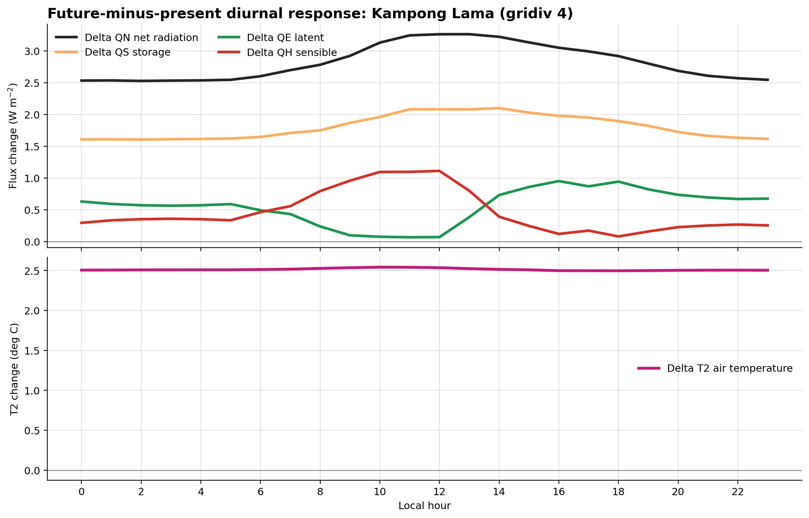
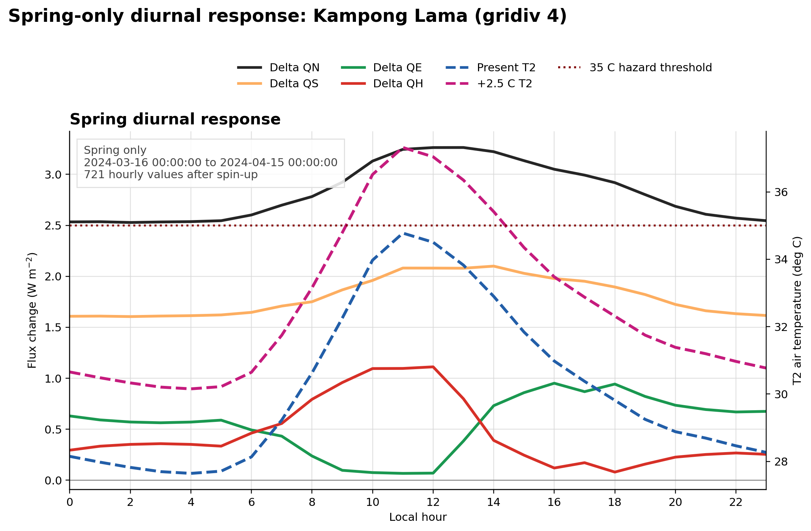

# UDA-city Heat Contrast Analysis

This practice run uses the UDA-city hackathon dataset: a synthetic,
lower-income, hot-humid, Colombo-like city with 10 neighbourhoods. I used the
provided SUEWS/SuPy configuration (`uda-city.yml`) and compared the present
hot-humid forcing against the supplied +2.5 C pseudo-warming scenario.

## Contrast Zones

- **Most built-up urban core:** Zheng He Towers (`gridiv 10`), building fraction
  `0.44`, green-blue fraction `0.15`.
- **Most vegetated suburban/refuge area:** Jade Gardens (`gridiv 1`), building
  fraction `0.047`, green-blue fraction `0.26`.
- **Highest risk in this run:** Kampong Lama (`gridiv 4`), using the reference
  risk bridge: `risk = minmax((hazard * exposure * vulnerability)^(1/3))`.

The meteorology is shared across neighbourhoods, so differences between zones
come from morphology, land cover, and socio-economic exposure/vulnerability.
The future forcing raises air temperature by exactly 2.5 C while keeping the
same hot-humid event structure. QF is off, so population affects risk exposure,
not model heat input.

## Socio-Economic Heat Risk Matrix

I translated the SUEWS hazard output into the reference bridge from
`bridge/heat-to-risk.md`: hazard is the count of post-spin-up hourly T2 values
above 35 C, exposure is daytime population density, and vulnerability combines
older people, young children, lack of AC, outdoor work, and deprivation. The
three pillars are min-max scaled to [0, 1] and combined as
`risk_index = minmax((hazard * exposure * vulnerability)^(1/3))`.

I classify risk as Critical for `risk_index >= 0.75`, High for `>= 0.50`,
Moderate for `>= 0.25`, and Low below that. The critical districts are:

| Scenario | District | Type | Dangerous heat hours | Hazard | Exposure | Vulnerability | Risk index | Priority |
|---|---|---|---:|---:|---:|---:|---:|---:|
| Present | Kampong Lama | hotspot | 34 | 0.60 | 1.00 | 0.95 | 1.00 | 1 |
| Present | Dhobi Lines | hotspot | 21 | 0.36 | 1.00 | 0.92 | 0.83 | 2 |
| Present | Fuzhou Lanes | hotspot | 17 | 0.28 | 1.00 | 0.97 | 0.78 | 3 |
| +2.5 C future | Kampong Lama | hotspot | 153 | 0.87 | 1.00 | 0.95 | 1.00 | 1 |
| +2.5 C future | Fuzhou Lanes | hotspot | 133 | 0.69 | 1.00 | 0.97 | 0.93 | 2 |
| +2.5 C future | Dhobi Lines | hotspot | 135 | 0.70 | 1.00 | 0.92 | 0.92 | 3 |
| +2.5 C future | Mlima Moto | hotspot | 100 | 0.38 | 1.00 | 1.00 | 0.77 | 4 |

The hottest refuge neighbourhoods still matter physically, but the reference
bridge gives them low aggregate risk because their daytime population density is
the minimum in this 10-neighbourhood dataset, so min-max exposure becomes zero.
That is a limitation of this relative indicator, not proof that no individual
there is vulnerable.

## Diurnal Flux Change And Air Temperature In The High-Risk Zone

For the high-risk zone, Kampong Lama, I first paired each present hourly value
with the same future-scenario hour and calculated `future - present` for the
heat-flux terms `QN`, `QH`, `QE`, and `QS`. The upper panel shows the diurnal
mean of those point-by-point flux changes after the 14-day spin-up, while the
lower panel keeps T2 as absolute present and +2.5 C scenario air-temperature
curves.

## Spring Diurnal Check

The saved hourly analysis only contains spring hours after spin-up, so this
figure shows Spring only. Heat-flux terms are still calculated as point-by-point
`future - present` changes, and T2 remains absolute present and +2.5 C scenario
air temperature. The dotted 35 C line is the same threshold used to count
dangerous heat hours in the risk matrix. The seasonal coverage file is kept as
the audit trail showing that no winter, summer, or autumn hours are available in
the current run.

## Surface Energy Balance Across Land-Cover Zones

Bars show the present-day daytime mean partitioning of surface energy for all
10 neighbourhoods, sorted from lowest to highest building fraction. QN is shown
as black markers; QH, QE, and QS are stacked to show the partition of available
energy. The green outline marks the most vegetated refuge, and the black outline
marks the most built-up core.

## Data Products

- [Hourly QH, QE, QN, QS, and T2 for present and +2.5 C runs](hourly_fluxes_t2_present_future.csv)
- [Socio-economic heat-risk matrix](heat_risk_matrix.csv)
- [Critical heat-risk zones](critical_heat_risk_zones.csv)
- [Point-by-point high-risk-zone future-minus-present heat-flux deltas](hourly_deltas_high_risk_zone.csv)
- [Diurnal high-risk-zone future-minus-present heat-flux deltas](diurnal_deltas_high_risk_zone.csv)
- [Spring point-by-point high-risk-zone heat-flux deltas](seasonal_hourly_deltas_high_risk_zone.csv)
- [Spring diurnal high-risk-zone heat-flux deltas](seasonal_diurnal_flux_deltas_high_risk_zone.csv)
- [Spring diurnal high-risk-zone T2 curves](seasonal_diurnal_t2_high_risk_zone.csv)
- [Seasonal data coverage check](seasonal_data_coverage_high_risk_zone.csv)
- [Land-cover zone summary](landcover_zone_summary.csv)
- [Meteorology summary](meteorology_summary.csv)
- [Risk-zone ranking](risk_zone_summary.csv)
- [Energy-balance summary](energy_balance_landcover_zones.csv)

## Honest Limits

This is a compact practice run: all 10 neighbourhoods were simulated, but the
window was limited to 14 spin-up days plus 30 analysis days to stay within the
desktop memory limit. In the current output, the post-spin-up period is
2024-03-16 to 2024-04-15, so the seasonal plot can only analyse spring. A true
four-season comparison needs full-year or separate seasonal present/future
forcing. SUEWS gives an environmental heat hazard, not a health outcome. The
socio-economic layer is synthetic, so ranks are more meaningful than absolute
values.
